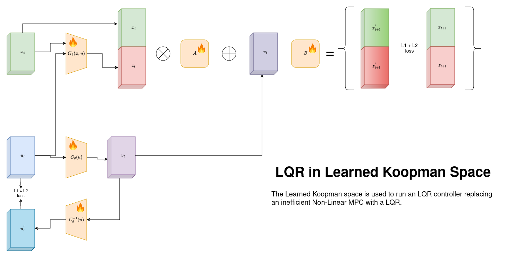

# Deep Koopman with Control for Drone Dynamics

## Overview
This project investigates the application of Koopman Theory to improve control performance in drone dynamics by reducing computational load and simplifying optimization compared to traditional methods.

## Problem Statement
Conventional motion planning for quadrotors often uses Non-Linear Model Predictive Control (MPC) with approximate drone dynamics, which can lead to suboptimal performance. Learning-based approaches, such as modeling dynamics as a Markov Decision Process (MDP) and fitting an RNN, achieve better results but limit optimization and sampling flexibility.

By leveraging Koopman Theory, we can transform the state space to linearize dynamics, allowing the use of a Linear Quadratic Regulator (LQR) instead of Non-Linear MPC to achieve similar performance with reduced computational complexity. Our project explores data-driven methods to learn a Koopman operator for drone control dynamics, focusing on:

- Replacing Non-Linear MPC with LQR control in Koopman space
- Utilizing randomly collected trajectories to learn the Koopman space (Offline Goal Conditioned Reinforcement Learning should be explored to extract a better Koopman Space)
- Implementing both discrete and continuous time control (Exploring PINNs-based models and PySindy for continuous-time data and DMD and Deep Koopman Space for discrete data)

## Dataset
We tested our models on data from:
- **Damped Double Pendulum**
- **Drone Data** from the Flightmare Simulator and Acados Toolkit

Additionally, we implemented a custom data generator in Acados.

## Key Insights and Limitations
While Koopman-based control offers efficiency and promising results, some limitations include:

1. **Control Input Constraints**: LQR does not inherently handle control limits, which may cause issues for out-of-distribution goals. To mitigate this, we implement model-based techniques to reduce errors. However, learning a Koopman space with bounded constraints is mathematically challenging because the linearized Koopman space imposes non-linear constraints.
  
2. **Mathematical Constraints**: Linearizing the state space while maintaining constraint bounds proved challenging, leading to theoretical limitations that impacted project completion.

## LQR in Koopman Space with State and Control Space Lifting

Given a nonlinear system:

$$
x_{t+1} = f(x_t, u_t)
$$

we transform it into Koopman space using a lifting function $$G(x_t, u_t)$$ for the state and control inputs, such that the dynamics can be approximated linearly:

$$
G(x_{t+1}, u_{t+1}) = K G(x_t, u_t) + B_K C(u_t)
$$

where:
- $$G(x_t, u_t)$$ is the lifting function that maps the state $$x_t$$ and control $$u_t$$ into the Koopman space,
- $$K$$ is the **Koopman operator** (the linear transition matrix in the Koopman space),
- $$B_K$$ is the control input matrix in the Koopman space,
- $$C(u_t)$$ is the lifting function for the control inputs.

### LQR Cost Function

The objective of LQR is to minimize the following cost function over an infinite time horizon:

$$
J = \sum_{t=0}^{\infty} \left( G(x_t, u_t)^T Q G(x_t, u_t) + u_t^T R u_t \right)
$$

where:
- $$Q$$ is a positive semi-definite matrix penalizing deviations of the lifted state in Koopman space,
- $$R$$ is a positive definite matrix penalizing the control effort.

### Optimal Control Law

The optimal control input$$u_t$$in the Koopman space is given by the feedback law:

$$
u_t = -K_{\text{LQR}} G(x_t, u_t)
$$

where $$K_{\text{LQR}}$$ is the optimal feedback gain matrix, derived by solving the **Discrete Algebraic Riccati Equation (DARE)** in the Koopman space:

$$
P = K^T P K - K^T P B_K (R + B_K^T P B_K)^{-1} B_K^T P K + Q
$$

Finally, the optimal feedback gain $$K_{\text{LQR}}$$ is:

$$
K_{\text{LQR}} = (R + B_K^T P B_K)^{-1} B_K^T P K
$$

This formulation allows for optimal control design in a linearized Koopman space, enabling efficient control for nonlinear systems using linear techniques.
